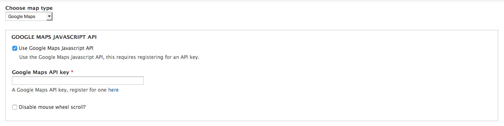
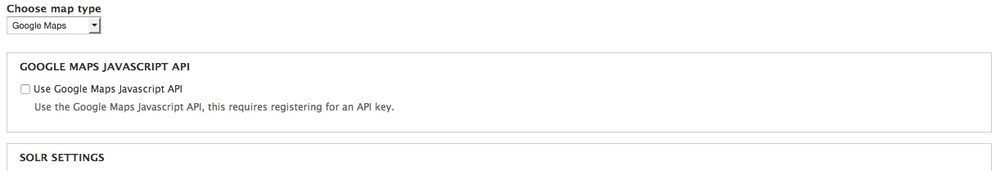
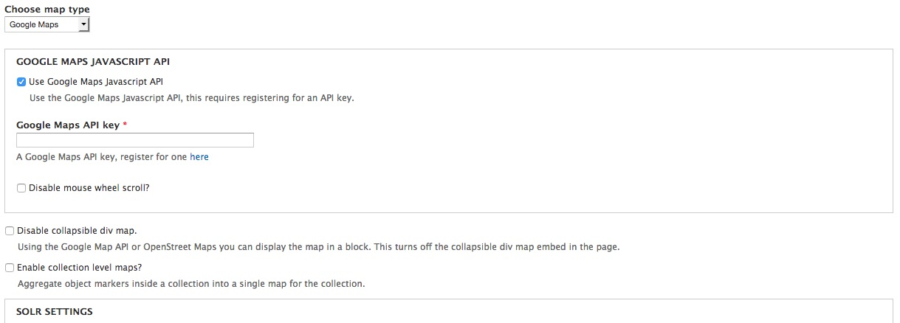
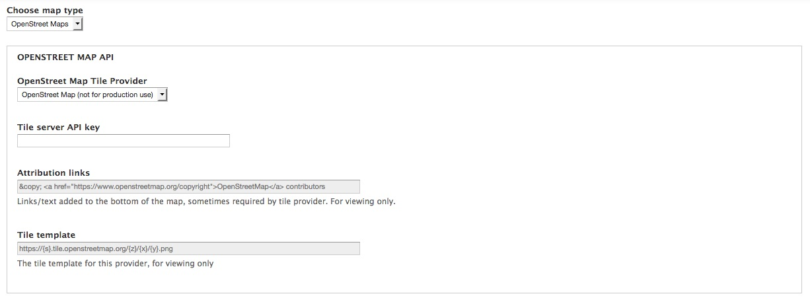
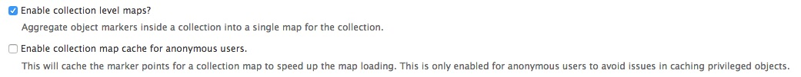
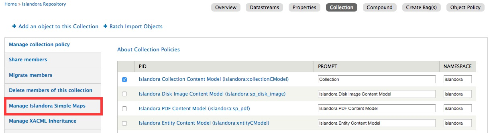
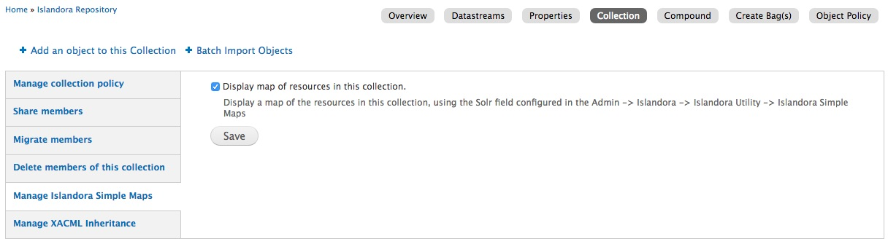
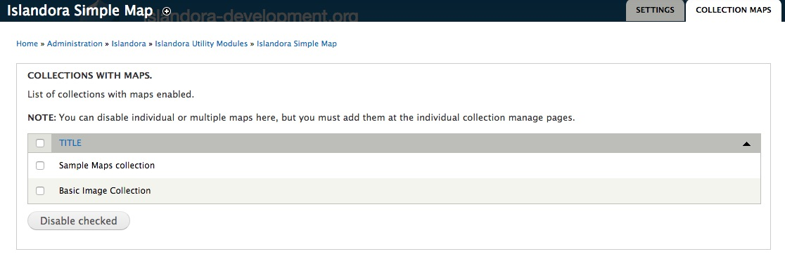
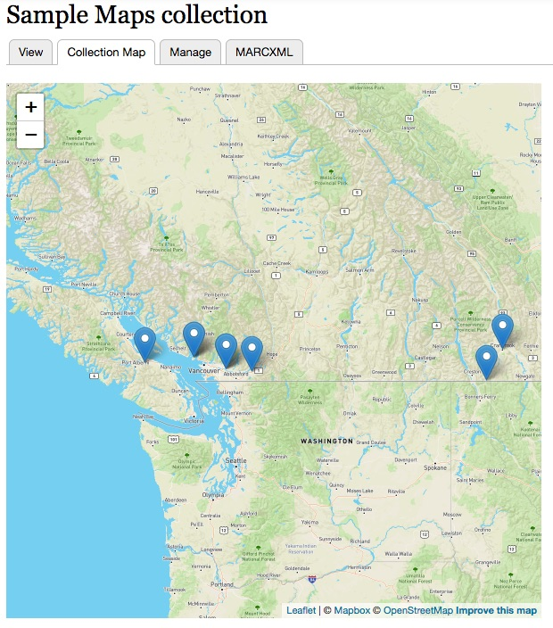
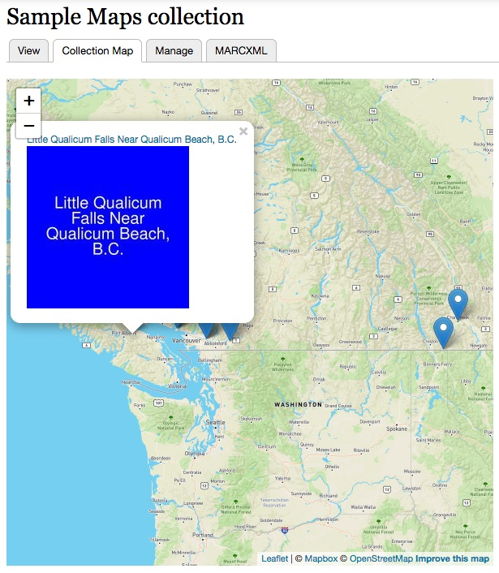

# Islandora Simple Map [](https://travis-ci.org/Islandora-Labs/islandora_simple_map)

Islandora module that provides the ability to add a map to an object's display. You can see it in action [here](http://digital.lib.sfu.ca/pfp-980/buffalo-stanley-park-vancouver-bc).

## Overview

This module can use geographic coordinates and place names in MODS (or other) elements to populate a Google or OpenStreetMaps map that is then appended to the object's display or displayed in a block.

This module allows use of either Google Map's [Embed API](https://developers.google.com/maps/documentation/embed/) or, for more functionality, the [Google Maps Javascript API](https://developers.google.com/maps/documentation/javascript/)
or [OpenStreetMap API](https://wiki.openstreetmap.org/wiki/API):

Feature | Embed | JavaScript / OpenStreetMaps
--- | --- | ---
API key | not required | required
blocks | not supported | supported
multivalued coordinates | not supported (first coordinate/place name only) | supported
place names | supported | not supported *
collection maps | not supported | supported

\* You can write a custom place name lookup to make use of the [hooks](#api) but this is not provided currently.

This module exposes two [hooks](#api) to allow developers to write their own function to extract information and return coordinates for display on the map
and to parse coordinates provided in various formats to decimal format for display.

See [Configuration](#configuration) for instructions.

## Requirements

* [Islandora](https://github.com/Islandora/islandora)

Install as usual, see [this](https://drupal.org/documentation/install/modules-themes/modules-7) for further information.

## Configuration

This module allows you to provide maps produced from [Google Maps](#google) or [OpenStreetMap](#osm)

Admin settings are available at `admin/islandora/tools/islandora_simple_map`:

You can select which to use with the **Choose map type** drop down.

### Google Maps



If you choose to use the Javascript API you will need to [get an API Key](https://developers.google.com/maps/documentation/javascript/get-api-key). If you choose to use the Embed API, you do not need an API key.

If you do not use the Javascript API some options are not available.

Embed API


Javascript API


Enabling the **Google Maps Javascript API** opens configuration for:

* Your API key (required).
* Disabling mouse wheel from causing map zoom.
* Additional [enhanced options](#enhanced-options) described below. 

The Embed API only displays the first coordinate found.

### OpenStreetMap



The OpenStreetMap allows you to choose between 3 tile providers (OpenStreetMap, MapBox and Thunderforest)

**Note**: The OpenStreetMap tile provider is for testing and very small sites. Read the [OpenStreetMap Tile Usage Policy](https://operations.osmfoundation.org/policies/tiles/)
for more information.

The other two providers will require you to register to get an API key.

The OpenStreetMap maps also provide additional [enhanced options](#enhanced-options) described below.

### Enhanced options

Using Google Maps with the Javascript API or using OpenStreetMap opens additional functionality including.

* Display **all** coordinates found and show multiple points on a map.
* Display a map in a block.
* Disable the map embed in the page. Useful if using the above map block.
* [Collection maps](#collection-maps).

### Common configuration options

Common configuration options are:

* A delimiter to split multiple coordinates on.
* the XPath expressions to the MODS elements where your map data is stored
* the map's height, width, default zoom level, and whether or not the map is collapsed or expanded by default, and
* option to clean up the data before it is passed to the map provider.
* option to display maps for compounds (in addition to their first child).

Once you enable the module, any object whose MODS file contains coordinates in the expected element will have a Google map appended to its display.

There is also the __Coordinates Solr field__ option if you index your object's coordinates. If you fill this in, then a
Solr query will be done to retrieve the collections coordinates instead of parsing each collection member's MODS record.

### Extract from MODS using XPath

Site admins can configure multiple MODS elements in a preferred order by entering XPath expressions in the admin setting's "XPath expressions to MODS elements containing map data" field. Data from the first element to match one of the configured XPath expressions is used to render the map. The module provide sensible default values that prefer `<subject><cartographics><coordinates>` over `<subject><geographic>`.

#### Using geographic coordinates to create maps

By default, the MODS element this module expects geographic coordintates to be in is `<subject><cartographics><coordinates>`. Geographic coordinates must be in "decimal degrees" format with latitude listed first, then longitude.

Google Maps is fairly forgiving of the specific formatting of the values when _using the Embed API_. All of these work:

```
+49.05444,-121.985
+49.05444 -121.985
49.05444 N 121.985 W
49.05444N121.985w
```

When using the Javascript API the coordinates need to be in a comma separated decimal format. 
```
+49.05444,-121.985
```

If your data is not in that format, you can create a small module using the [API](#api) to transform your data.

Semicolons separating the latitude and longitude are not allowed, resulting in a map with no points on it:

```
+49.05444;-121.985
```

There is an admin option to "Attempt to clean up map data".

If this is enabled (which **it is by default**), a semicolon in the data will be replaced with a comma before it is passed to Google Maps.

This option can be enabled, but this cleaning occurs **before** splitting multiple coordinates. 
So if semi-colons are used to delineate multiple coordinates this can cause problems.

Example:

`+49.05444,-121.985;+49.895077,-97.138451`
becomes
`+49.05444,-121.985,+49.895077,-97.138451`

Then splitting on `;` would fail.

Alternatively you can use multiple `<cartographic><coordinates></coordinates></cartographic>` elements and
place one coordinate in each.

#### Using place names and other non-coordinate data to create maps

_Embed API Only_

If you configure this module to use MODS elements that do not contain coordinate data, such as `<subject><geographic>`, Google Maps will attempt to generate a map based on whatever data it finds in the configured element. However, the results of using non-cartographic coordinates are not always predictable. For example, the following two values for `<subject><geographic>` produce accurate maps, presumably because they are unambiguous:

```
Dublin, Ireland
Dublin, Ohio
```

but a value of just `Dublin` results in a map showing the Irish city. Another example that illustrates Google Maps' behavior when it is given ambiguous data is a `<subject><geographic>` value of `City of Light`, which results in a map showing a church by that name in the US Northwest, not Paris, France, probably because when I wrote this I was closer to that location than to Paris. From Europe, for example, you get a completely different location for a `<subject><geographic>` value of `City of Light`. Also, if Google Maps cannot associate the data with a geographic location (predictable from a user's perspective or not), it produces a map showing a large portion of the world (depending on the default zoom level in effect) with no points on it.

The XPath expressions used to retrieve map data are executed in the order they are listed in the admin settings. So, for best results, listing the expressions in decreasing likelihood they will contain reliable and unambiguous data is the best strategy. The defaults values do this.

**Note**: If you wish to reproduce this behaviour using the Javascript API you would need a new hook implementation using the 
[Google Places API](https://developers.google.com/places/) to convert place names to coordinates.

### Collection maps

Collection maps provide a single map with markers for all items directly in the collection (does not include sub-directories).

If you have checked the "Enable collection level maps?" option, you can then enable a map for each collection within the collection's Manage subtabs.



You can also cache collection points for anonymous users, this can significantly improve performance on maps with large
numbers of points.

To enable a collection map, manage the collection and choose the **Collection** tab.


Choose the _Manage Islandora Simple Map_ tab.


Check the "Display map of resources in this collection" checkbox and click **Save**. You can also un-check and **Save** 
to disable a collection's map.

You can also find a listing of all enabled collection maps on the **Collection Maps** tab of the admin screen.
From here you can disable one or more collection maps.


Collection maps appear as a new tab on the Collection.


Each marker is clickable with a tooltip of the title and thumbnail of the object and a link back to the resource.


## API

`hook_islandora_simple_map_get_coordinates(AbstractObject $object)`

Implementations of this hook should return an array of decimal coordinates. 
These are merged with all other implementations. 
If you are using the Javascript API, they are then validated/filtered to ensure they are decimal coordinates.
Lastly (using either API) they are de-duplicated to determine the points to show on the map.

`hook_islandora_simple_map_parse_coordinates_callback()`

Implementations of this hook should return an array of the format.
```
  array(
    'my_module_implementation' => array(
      'function_name' => 'islandora_test_parse_coordinates',
      'file' => drupal_get_path('module', 'islandora_simple_map') .
      'includes/test_functions.inc',
      'weight' => 100,
    ),
  );
```
Where
* `function_name` is a function that accepts an array of coordinates of various formats and returns an associative 
array of coordinates that it could parse where the key is the original value and value is the parsed value.
* `file` is the file to include to access this function. (Optional)
* `weight` is to order the hooks. Default is 100. (Optional) 
## Maintainer

* [Mark Jordan](https://github.com/mjordan)
* [Jared Whiklo](https://github.com/whikloj)

## To do

* Add a Drupal permission to "View Islandora Simple Map maps".

## Development and feedback

Pull requests are welcome, as are use cases and suggestions. For example, if your coordinate data results in maps with no points on them, please suggest some ways that the data could be normalized (and don't forget to include some sample data).

## License

* [GPLv3](http://www.gnu.org/licenses/gpl-3.0.txt)
